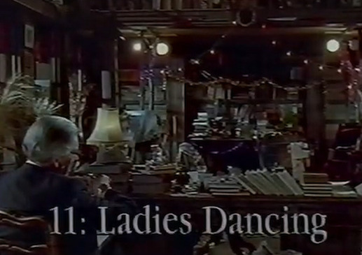

# Episode 11: Eleven Ladies Dancing

**SA:** You brought the ladies?

**LK:** Yes.

**SA:** All 11 of them?

**LK:** Yes.

**SA:** But are they dancing? That's more to the point.

**LK:** Oh, yes.

**SA:** I don't trust you BBC people an inch. Come on, let's get on with it.

**LK:** Well, Sir Arthur, your son.

**SA:** Oh, good grief, Roger. Yes, what about him?

**LK:**  ... had a somewhat unconventional upbringing.

**SA:** Well, he had him educated privately, if that's what you mean.

**LK:** But not by governesses ...

**SA:** No. By goats. Not by governesses. Goats.

**LK:** Despite your own childhood experiences with goats.

**SA:** It was either that or King's School Canterbury, and I'm not entirely heartless, you know.

**LK:** How did you provide for the goats to bring up your son? Did they have a a stipend or an annuity?

**SA:** Yes ... (mumbles) I got(?) a stipend or an annuity, and we left that very much up to them. I mean, once you start trying to boss a goat about you, you find they they tend to take against you. Bob Harrelson of Cootes, he dealt with all the technicalities of the thing. And he was delighted to have the goats pop in at any time.

**LK:** Did that happen often?

**SA:** Never. Never once. Rather rude of them, I thought, after all the trouble we've been to.

**LK:** So how did they survive?

**SA:** The goats?  Well, they survived very well the usual way.  They had their goat house, which is quite large. It was about a mile from the main house, surrounded by asphalt through which weeds grow up and the goats live off the weeds. And, obviously, Roger learned to live off the goats which, lived off the weeds. That's how it was done, really.

**LK:** Did he have any formal education?

**SA:** Yes. We arranged for him and, the goats who he believed were his parents, to go down to a very good prep school near Lymington in Hampshire, and they duly traveled down there, "en famille" as it were.

**LK:** By train?

**SA:** No. His mother, his his real mother, that is, not his goat mother, drove them.

**LK:** By car?

**SA:** No, no, no. With a twig, a switch, a stick thing. That's how you get goats from one place to the other. You bang them on the backsides with a twig. Besides, I don't want goats in my wife's car, thank you very much.
The smell is absolutely frightful.  She wears this awful scent, "Muriel" by Paco Rabanne.  Absolutely ghastly. I try to cover it up by keeping a bag of potpourri in the glove compartment, but you you can't disguise it. You can't.

**LK:** How did the interview with the headmaster go?

**SA:** Frankly, it was a bit of a disappointment. The goats managed to get in by sheer force of personality, I suppose, but Roger was rejected.

**LK:** How did you feel?

**SA:** I was elated. I'm very much a self made man myself. After I'd outgrown my own goats, my father kept me locked in a broom cupboard till I was 15 with a pair of encyclopedia.  And I've always found that quite enough in life. Flags of the world, semaphore, deciduous trees, difference between a mammal and a snake.

**LK:** What is the difference between a mammal and a snake?

**SA:** Well, snakes are long, thin, scaly things, and mammals, of course, are big, fat, hairy things. That's the difference between them. And insects are neither one thing or the other. Nobody knows if they're mammals or snakes, and, frankly, I don't care.

**LK:** Like whales?

**SA:** Yes. I do like whales, as a matter of fact. Well, I I wouldn't want a son of mine to be suckled by one.

**LK:** You left it very much up to the goats then, his education.

**SA:** Well, I think once one had made the decision to let it be reared by goats, it would have been unfair to interfere with his way of life. You see, looking back in history at people who've been suckled by animals, wolves, for example, you'll find that they often go on to achieve considerable distinction in later life. One's only got to think of Romulus and Remus who went on to find the Roman Empire. As you know, Romulus built Rome and, Remus, built Reems.

**LK:** Rheims.

**SA:** No, no, no! That was Ramesses. Ramesses the second, suckled by tapirs.

**LK:** Has anything similar been achieved by children suckled by goats?

**SA:** Gothenburg possibly. I, I really don't know.

**LK:** Thank you, sir Arthur. No more questions.

**SA:** Oh. Where are these bloody ladies? I tell you, if they're not dancing, there'll be hell to pay. You can't come through here, it's private. It's outside. Where are you? Oh, god, they moved the bloody van.

They put you around the back.

00:04:17 [Speaker 1]
Yeah.
00:04:17 [Speaker 1]
Where did you did you ask them to go around the I can't hear what no.
00:04:22 [Speaker 1]
They're still in the room.
00:04:23 [Speaker 1]
Yeah.
00:04:24 [Speaker 1]
There's an awful man with yellow trousers keeps wandering around in some bit of darkened glass which he holds up to his eye and spins through.

00:04:30 [Speaker 1]
I don't know what they're doing.  Who is around the front? They can't be around the ... oh, god almighty.
00:04:37 [Speaker 1]
Yeah.

Well, I don't know.
They're getting a decent fee, I suppose.

No.

**SA:** Hold on. Look, I'd be very pleased if you don't just push off.

Yes.

Yes.

**SA:** We've got some royalty coming around for tea, I think.  So just go away if you can. Thank you.
