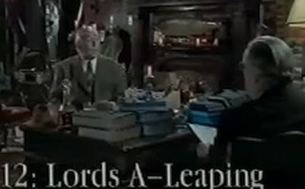

# Episode 12: Twelve Lords A-Leaping

**LK:** Well Sir Arthur I very much enjoyed our talks.

**SA:** They've been fun, haven't they.

**LK:** Yes but now we come at last to your final gift and what's that?

**SA:** My last gift I'm sure you've guessed it is Twelve Lords A Leaping.

**LK:** Why have you chosen that?

**SA:** Well as a Christmasy thing really, to remind us all in this season of goodwill of the 12 wise lords who came leaping into the stable at Bethlehem at the birth of our saviour.

**LK:** I don't think they did that, Sir Arthur.

**AR:** Oh yes, "boing boing boing", as in the carol.

**LK:** No I'm afraid you're mistaken.

**SA:** You sure?

**LK:** Yes, quite certain.

**SA:** Blast, oh dear, very confusing um now, I can never remember who was in the stable. Must have been the uh, the hens, was it? Three hens? No, very sorry about this. Was it the goats that were in the stable? Uh, partridges? One partridge, two turtle-doves, three French Lords four enormous larks, twelve leaping lizards, hens, da ... I'm in a bit of a muddle ... Not much of a Bible buff myself I'm afraid. Don't take much interest. Christmas, it used to be great fun in the old days, when it was simply an orgy of commercial excess, but now I find people are tainting the whole thing with a lot of religious mumbo jumbo. Thank the Lord it's over for another year.

**LK:** Yes I was going to ask you Sir Arthur how will you spend the rest of your year?

**SA:** Oh well uh the rest of the year, that goes completely into preparation with the Greebling fête. I have to go around putting signs up on all the trees saying August the 4th fête to get the villagers interested. I always start putting these up good and early on about August the 5th generally, as soon as the previous fête has lumbered to a close. I like to give plenty of notice.

**LK:** You raise a lot of money for charity I understand.

**SA:**  Oh an enormous amount yes, an enormous amount ... because fortunately we have very low overheads. What we do is we simply throw open the grounds and invite villagers in to buy nettles, grass, goats, sparrows,
worms, flies ... anything in fact that flourishes in the garden is theirs for under a fiver. That money is then plowed back into my bank account.

**LK:** Do you have stalls for the produce or is it more pick your own?

**SA:** We find that people get more pleasure in picking their own and in pursuing the worm particularly on their own, it's a lonely sort of hunt the excitement that that sort of thing. Pick your own nettles is quite popular, I suppose largely because the sign says "Mint". As a result we sell an awful lot of dock leaves. My own favorite is the bring and buy aspect that villagers bring a lot of their stuff and then buy it back from us at a small percentage. 100 I think, it is yes a 100%. They enjoy that and of course we do have peg dancing.

**LK:** Is that uh like Morris dancing

**SA:** Yes it's very like Morris dancing really a woman called Peg comes in and dances.

**LK:** You're very fond of the gardens here at Greebling Sir Arthur?

**SA:** Oh yes I'm tremendously tremendously fond of the gardens because we keep them uh right outside here you see. And they're they're absolutely beautiful that's why I so completely devastated by those storms we've been having recently. They played havoc with the grounds ...  had an enormous number of beautiful trees blown over blown over from the neighbouring properties, which landed here and took root. Absolutely ruined the putting green.

**LK:** Nevertheless the garden is open again now and is very popular with the public. Why do you think that is?

**SA:** Well I think probably people are attracted by the enormous sign outside on the A34 saying "Miniature Railway, Farm, Zoo, Vintage Car Museum, Tropical Aquarium, Jousting Exhibitions, Bonsai Garden and Licensed Restaurant.

**LK:** It is very impressive, yes.

**SA:** Uh it is, isn't it? Uh one of our neighbours, the Duke of Bedford, very kindly allowed us to steal it from him. But Greebling is not a large garden. It's nothing like Woburn or Blenheim or any of those places. It's a compact garden. We have vines of course. Oh no, we don't have vines actually ... we don't have any vines at all, not even a hint of a vine. But we have uh, we have cacti.

**LK:** why do you think people keep coming because you don't have very many cacti, do you?

**SA:** Uh just the one. Well as I say uh I have a hunch that the sign may have something to do with it it is a lovely sign, we just keep it outside. We keep all the outside, outside. But more than that, it's ... it's a garden you can get around in a day isn't it? Well you can get around in a minute actually, you don't have to waste a whole day trailing around the garden and your time is your own.

**LK:** And entry is free, is it?

**SA:** Entry yes it is free, but exit is very very expensive. It costs absolutely nothing to get in and £100 to get out. It's a walled garden and apart from the cactus that's it.

**LK:** Well finally Arthur I feel I've got to know you a lot better over these last 12 days but I'm still curious as to one thing, what is it in the end that you really believe in?

**SA:** Well um I like to say I believed in God of course but I'm afraid as a thinking person who cares about the world around him there two very good reasons why I simply can't.

**LK:** What are they?

**SA:** Well em wasps. I can't see the point of a wasp, can you? Absolutely pointless. And b, caviar. I mean really, what is the point of having caviar locked away inside sturgeon ... so inaccessible. I'm sure if a real God he would have arranged for caviar just to toddle over to your house on a a pair of little legs in a self-opening jar.

**LK:** Sir Arthur thank you.

**SA:** Oh thank you and uh, season greeblings to you and of course your family.
