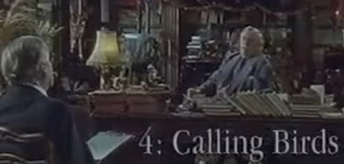

# Four Calling Birds

**LK:** Sir Arthur, you have traveled widely.

**LK:** Yes, I've traveled widely, but not too well.

**SA:** Yes I used to say - better to travel widely than to arrive, if you understand me: travel widens the well they say in the Sahara. "Arrive arrive oh, arrive arrive oh",  as they say in Dublin's fair
city ... but I suppose, as a short answer to your question, yes thank you very much, I will.

**LK:** What's your favorite place in the world?

**SA:** I think I'd have to say the the Galapagos Islands ... extraordinary creatures live there, in the Galapagos. The beautiful little two-footed millipede to name but one. What particularly lodges in my mind is the
armadillos. The luminous armadillos which are extraordinary to see, they, they swim in formation off the coast there. Absolutely dazzling.

**LK:** What is the cause of their luminosity? Phosphorescence?

**SA:** Paint.

**LK:** Paint?

**SA:** Luminous paint, that's put on them.

**LK:** By whom?

**SA:** By the painter bird. These are birds which once a year fly over to Latin America, dive into huge vats of luminous paint and then fly all the way back and wipe themselves off on the armadillos.

**LK:** That does sound a little unlikely Sir Arthur, if I may say so.

**SA:** It is. Alot of things in nature are unlikely. I mean, who can imagine an animal called the Prottle entirely made out of curtain rings?

**LK:** Does such an animal exist?

**SA:** No, that's what I said, who could imagine it?

**LK:** Now for your fourth gift.

**SA:** Certainly, yes I would like four enormous larks please.

**LK:** Well I'm very sorry to tell you Sir Arthur that that has proved impossible at such short notice. We have in fact got you four calling birds.

**SA:** Well calling birds they are no bloody use to anybody. I ordered four enormous larks and you come up with calling birds? I mean calling birds are nothing like enormous larks. I mean, I was all geared up to reminisce about various things, and, frankly, I insisted on, four enormous larks for a very good reason because four enormous larks would trigger off trigger off memories. Memories of, well, I don't know what. I mean, if there were four enormous larks out here on the lawn, then they would they would trigger off a memory. But there aren't four enormous larks here on the lawn. There's bugger all here on the lawn apart from grass and anything it triggers off is a sort of memory of just looking out of the window now and seeing the lawn completely denuded of larks, which is not the sort of thing I want to talk about at all. As for these calling birds, they don't remind me of anything. All they remind me of is how we sort of should have had these four enormous larks here and how annoying it is. I mean it just seems to heave reached a complete impasse.

**LK:** You were, I believe, in the twenties in Montparnasse.

**SA:** What?

**LK:** Paris in the 20s.

**SA:** Paris in the? ... 20s. Oh yes, in the twenties in Paris, with all the larks in Montparnasse. It was a bit like London in the 60s actually but in black-and-white and without subtitles. I was very poor. I had a pathetically weedy little moustache, and I was absolutely homeless. But I was young and desperately wanted to paint.

**LK:** You knocked on the first door you came to?

**SA:** Yes and I painted it. There was no answer but the door swung open and there in the centre of the room was this most peculiar melting bed draped over an ironing board: I had stumbled into the garret of Salvador Dali.

**LK:** Fascinating

**SA:** Yeah what looked like a melting mattress over an ironing board was in fact his landlady Madame de Chevignon. Dali himself had to leave in a hurry due to an accident with a burning giraffe silly fool. He could never look after them.

**LK:** And later you met Edith Piaf?

**SA:** Yes, in that very room. I remember I was talking to her on this particular occasion she said to me "Je ne regrette rien" and I said "oh come on, Edith there must be something". She said absolutely not apart from possibly, I suppose, agreeing to come to this room this very evening. Do you know I admired her? I admired her for her honesty.

**LK:** You lived with Piaf in Paris for some years I think.

**SA:** No I sat with her in Paris for some seconds.

**LK:** But you did know the surrealist well?

**SA:** Oh yes I loved the surrealists, very nice folk. Beautifully well behaved people in a bizarre kind of way. Magritte was a pain in the ass there with his boiled eggs on lampposts. Dali was a bit unreliable, never showed up of course, but the rest of them were great bunch of mates, a great bunch of mates. I was very much part of the ploppy ploppy noink noink that they moved in.

**LK:** What?

**SA:** I was very much part of the ploppy ploppy noink noink that they moved in.

**LK:** Of the circle they moved in?

**SA:** No no no, they didn't move in a circle, good grief. The idea of surrealists moving round and round in a circle is ludicrous, conjures up a picture which is completely surreal. No, they didn't move in a circle, they moved in a hot water bibble.

**LK:** A hot water bottle?

**SA:** Bibble. They despised hot water bottles, wouldn't have them in the house: "Bourgeois!" they said. Apart from Magritte, Magritte had a hot water bottle he used to boil his eggs in it whenever he needed one for a lamppost or whatever. We all disliked him intensely.

**LK:** Why?

**SA:** Frankly, we thought he was a bit mad. Frightful little man with that stupid little wax moustache on his bottom.

**LK:** Thank you sir Arthur

**SA:** If you just could have had have the larks here then I could remember something. All I can remember is you didn't bring the larks, frightfully disappointing.
