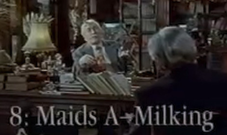

# Episode 8: Eight Maids A Milking

**LK:** Sir Arthur, after the war, I think you went into the city where you briefly worked for a commodity broker in Threadneedle Street.

**SA:** Yes, em ... [gets up to laundry basket to retrieve a new packet of cigarettes] a broker called, oddly enough, Fred Needle. Charming chap. And, worked in the futures market.

**LK:** How does that work?

**SA:** Oh basically, you have to get a hold of a number of clients with lots of money, and they they give it to you to speculate with. If, for example, you came to me and told me you thought the price of litchen or lichen was going to go up, I'd pocket the money and hope it went down and say "sorry, old chap, you've lost your money". If it went up, I'd change my name and start all over again.  That's basically how it works.

**LK:** Did you do well?

**SA:** Initially, yes, I did very well but along came the Korean War and uh I took the view that liniment would probably go up during the war because obviously there'd be a lot of injuries and people would need to rub liniment into their legs but, uh, unbeknownst to me Korea is absolutely littered with liniment wells which could produce about 15 million barrels a day so I had a liniment glut on my hands which was thoroughly unpleasant as you can imagine.

**LK:** And was that when you moved back home to Greebling Manor?

**SA:** Yes. As as you know, my father and I were never particularly close, but, he was in the autumn of his years and one day I received a particularly upsetting telegram from him, which, really meant I had no alternative but to return home.

**LK:** It was his last wish?

**SA:** Well, it was the last thing he wanted was the way he phrased it, but, I knew what he meant. In those days, Greebling Manor was surrounded by over 28,000 acres of wonderful farmland, none of which, unfortunately, belonged to us. My father didn't see why that should stop us farming it secretly.

**LK:** How do you mean "farm it secretly"?

**SA:** Well, we would rise about 2AM, preferably on a night when there was no moon, and, go out into the adjacent fields and till them.  I do the weeding, hose down a neighbor's Land Rover, that sort of thing.  Very much the sort of thing a normal farmer does except done secretly and not on one's own land. Plowing, harrowing, blocking the local roads with sheep, yelling at people to get off the property, that sort of thing.

**LK:** What was the idea?

**SA:** I haven't the foggiest, it was absolute madness. My father was working all night long basically for the benefit of the bloody next door neighbors. They woke up each morning, their farm which had been an utter tip the night before, looked absolutely tickety boo. He even stacked the cowpats in a mash of the little piles.

**LK:** But your own concept of secret farming was different?

**SA:** Yes. Entirely different, entirely different. To me, secret farming meant going into the fields by night and planting very quick growing crops, which one can then harvest by dawn. The secret is to find a product that grows very, very quickly indeed.

**LK:** What uh, mustard and cress or something like that?

**SA:** Oh good heavens no. Mustard and cress is far too slow. Mushrooms: they're the chaps. You've heard of the button mushroom, well, we cultivated pinpoint mushrooms. Very, very small indeed because they'd often only been growing for as little as twenty minutes before plucking.

**LK:** Some might say that was rather sharp practice.

**SA:** Best eaten raw with a little bit of fresh lemon and a spot of pepper. Next question.

**LK:** Secret dairy farming, sir Arthur?

**SA:** Yes. Secret dairy farming. Now, that really made a great deal more sense.

**LK:** Hence your eighth gift. Eight maids a-milking.

**SA:** Yes. We always use maids, Filipino maids, working in teams of eight. Seven on each team were employed by me, secretly milking up to a 100 cows a night. And the other one worked for my father doing any secret washing up, secret hoovering, and so on as he felt needed doing.

**LK:** A very sensible arrangement, sir Arthur. Thanks you.

**SA:** Thank you.
