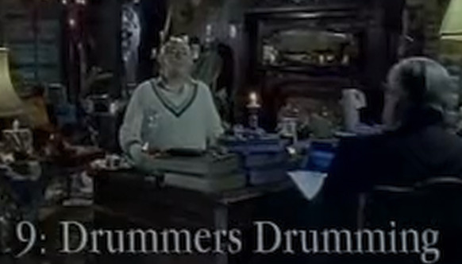

# Episode 9: Nine Drummers Drumming

**SA:** In 1932, sir Arthur, you went up to Cambridge.

**LK:**: Were you a scholar?

**SA:** Oh, good lord, no, no. When I entered Cambridge, the only qualification one needed was the Russian for "homosexual".

**LK:** You studied under professor Hillary, I think.

**SA:** Hillary, yes.

**LK:** Who used to recruit for MI6.

**SA:** Yes. Hillary was a spymaster. He was always looking out for recruits, people who could work secretly for or against the government.

**LK:** He wasn't bothered which?

**SA:** Well, not his job. He merely recruited and then melted away into the background.

**LK:** So you became a deep level mole at that time.

**SA:** That sounds awfully dramatic, doesn't it, deep level mole? But, you know, half of the business is spying. It's just routine, really. Other important stuff is simply paperwork, you know, reading through transcripts of conversations, transcripts of telephone conversations, conversations over the garden wall, conversations on aeroplanes, conversations in bathrooms, conversations in potting chairs, all sorts of conversations, transcripted, and then, built up to form a picture. A picture of what? A picture of, everybody in the world, really. You see, MI6's view is that if you know exactly what every single person in the world is going to do at any given time, we'll be able to anticipate what they'll do next. But as you can imagine, the paperwork is absolutely monstrous.

**LK:** Yes. I can imagine.

**SA:** I mean, for example, we've been so busy collecting all the relevant information. It was only in March, I think, far, far too late, that we predicted that, war was inevitable. When?

1914, I think it was. We're dreadfully behind at the moment. Dreadfully behind with all this paperwork. But, a lot of us are popping into the office over the weekend to try and, try and catch up. We're doing our best.

**LK:** Was it professor Hillary who first introduced you to the aphids?

**SA:*** The aphids. Yes, sir. That was a secret society in Cambridge. Very, very exclusive and aristocratic. One dressed up in fourteenth century costumes with, frilly collars and gigantic red flowing wigs and met in the crypt under Saint Bartholomew's every Tuesday evening.

**LK:** How did you become a member?

**SA:** [Camera close-up] One was approached.

**LK:** Covertly?

**SA:** Yes. They were very, very discreet. I was actually told later that I had been approached 30 or 40 times before my successful luring.

**LK:** What was the vetting procedure?

**SA:** You had to swallow four bottles of vintage port from a silver bucket, and you were then expertly probed by the, Master Aphid whose name I forget. 

**LK:** Aphid?

**SA:** Aphid. That's the fellow. And wherever I went in life after that, if ever I got the secret sign, I knew I was amongst friends and colleagues.

**LK:** The secret sign?

**SA:** Yes. Chap in a red wig and a pair of bulbous lacy pantaloons waving a bucket of port at you. That's a giveaway.

**LK:** 1934. The aphids went on a coach trip to Barcelona.

**SA:** Yes. The ostensible purpose was to view the cathedral.

**LK:** Your actual purpose was what?

**SA:** Exactly the same. This is one of the secrets of good, espionage, to be pretending to be doing exactly what you are doing.

**LK:** But you were the only one who wasn't pretending.

**SA:** No. I was pretending to pretend. There were 12 of us on the bus, and only one returned. I don't think it takes a genius to work out who that was. Barlow. I slipped away by submarine.

**LK:** So only Barlow knew of the incident at the cathedral when 10 aphids fell to their deaths because their gargoyle snapped off at the root.

**SA:** Yes. You see, the reason why the 10 aphids had to go was that we'd been penetrated.

**LK:** By Hillary?

**SA:** By professor Hillary, who'd introduced me to them in the first place and knew of their existence due to his copious files.

**LK:** Of course, later you found out that Hillary had been penetrating Barlow, didn't you?

**SA:** Yes. And once Hillary had penetrated him, the aphids were no more.

**LK:** Is Hillary still alive?

**SA:** In as much as he ever was, yes. He must be in his eighties now, but his mind is still as sharp as a sharp as a ...

**LK:** A razor?

**SA:** Sharp as an eraser. Yes, sir. That's about the size of it.

**LK:** And what became of Barlow?

**SA:** Barlow confessed to the government that he was working for them and got forty years. This pleased our masters in Moscow, so honour was satisfied.

**LK:** And finally, what's your ninth gift, Sir Arthur?

**LK:** I think you know me better than to ask me a question like that.

**LK:** It's nine drummers drumming, isn't it?

**SA:** I'm afraid you won't catch me out that easily. My lips are sealed.

**LK:** Thank you, sir Arthur.

**SA:** Come back in 2075. I might have a little something for you then. Enough so.
